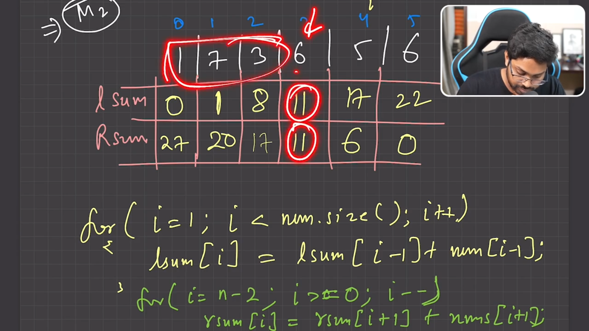

## 1. Question Link
# 724. Find Pivot Index
- [LeetCode: Find Pivot Index](https://leetcode.com/problems/find-pivot-index/submissions/1589492730/)
- [LeetCode: Find Middle Index in Array](https://leetcode.com/problems/find-the-middle-index-in-array/description/)
- [LeetCode: Left and Right Sum Differences](https://leetcode.com/problems/left-and-right-sum-differences/)


## 2. Problem Statement

Given an array of integers `nums`, calculate the pivot index of this array. The pivot index is the index where the sum of all the numbers strictly to the left of the index is equal to the sum of all the numbers strictly to the right of the index.

If the index is on the left edge of the array, then the left sum is 0 because there are no elements to the left. Similarly, if the index is on the right edge, the right sum is 0.

Return the leftmost pivot index. If no such index exists, return `-1`.

## 3. Sample Input and Output

**Example 1:**

- **Input:** `nums = [1, 7, 3, 6, 5, 6]`
- **Output:** `3`
- **Explanation:**  
  Left sum = `1 + 7 + 3 = 11`  
  Right sum = `5 + 6 = 11`  
  Pivot index is `3`.

**Example 2:**

- **Input:** `nums = [1, 2, 3]`
- **Output:** `-1`
- **Explanation:**  
  No index exists where the left sum equals the right sum.

**Example 3:**

- **Input:** `nums = [2, 1, -1]`
- **Output:** `0`
- **Explanation:**  
  Left sum = `0` (no elements to the left)  
  Right sum = `1 + (-1) = 0`  
  Pivot index is `0`.

## 4. Detailed Explanation

The task is to find an index in the array such that the sum of elements on its left equals the sum of elements on its right. A naive solution involves calculating the sum for every index by iterating through the array twice, once for the left and once for the right. However, this can be inefficient for larger arrays.

An optimal approach uses prefix sums to pre-calculate the cumulative sums from the left and right. This way, you can compare the left sum and the right sum at each index in a single pass.

## 5. Approach / Thought Process

- **Method 1: Brute Force Approach**
  - **Idea:**  
    For each index `i`, compute the sum of elements to the left and to the right. If both sums are equal, return `i`.
  - **Pros:**  
    Straightforward to implement.
  - **Cons:**  
    Has a time complexity of O(n²), which is inefficient for large arrays.

- **Method 2: Optimal Approach using Prefix Sum**

  - **Idea:**  
    Build two auxiliary arrays:
    - `lsum[]`: where `lsum[i]` holds the sum of elements to the left of index `i`.
    - `rsum[]`: where `rsum[i]` holds the sum of elements to the right of index `i`.
    Compare `lsum[i]` and `rsum[i]` for each index `i` and return the index where they are equal.
  - **Pros:**  
    This method runs in O(n) time after computing the prefix sums, making it much more efficient.
  - **Cons:**  
    Requires extra space for the two prefix arrays.
  - 

## 6. Actual Code in C++

### Method 1: Brute Force Approach

```cpp
class Solution {
public:
    int bruteforce(vector<int>& nums) {
        int n = nums.size();
        for(int i = 0; i < n; i++) {
            int suml = 0;
            int sumr = 0;
            // Calculate left sum
            for(int j = 0; j < i; j++){
                suml += nums[j];
            }
            // Calculate right sum
            for(int k = i + 1; k < n; k++){
                sumr += nums[k];
            }
            if(suml == sumr) return i;
        }
        return -1;
    }
};
```

### Method 2: Optimal Approach using Prefix Sum

```cpp
class Solution {
public:
    int pivotIndex(vector<int>& nums) {
        int n = nums.size();
        vector<int> lsum(n, 0);
        vector<int> rsum(n, 0);
        
        // Build the left sum array
        for(int i = 1; i < n; i++) {
            lsum[i] = lsum[i - 1] + nums[i - 1];
        }
        
        // Build the right sum array
        for(int i = n - 2; i >= 0; i--) {
            rsum[i] = rsum[i + 1] + nums[i + 1];
        }
        
        // Compare left and right sums for each index
        for(int i = 0; i < n; i++) {
            if(lsum[i] == rsum[i]) return i;
        }
        
        return -1;
    }
};
```

## 7. Code Explanation and Dry Run

### Code Explanation

- **Brute Force Method:**
  - For every index `i`, two loops compute the sum of elements to the left (`suml`) and right (`sumr`).
  - If `suml` equals `sumr` at any index, that index is returned as the pivot.
  - If no pivot is found after checking all indices, `-1` is returned.

- **Optimal Prefix Sum Method:**
  - **Left Sum Array (`lsum`):**  
    `lsum[i]` stores the cumulative sum of elements from the beginning of the array up to `i - 1`.
  - **Right Sum Array (`rsum`):**  
    `rsum[i]` stores the cumulative sum of elements from `i + 1` to the end of the array.
  - After building both arrays, a single loop checks for any index `i` where `lsum[i] == rsum[i]`, returning that index as the pivot.

### Dry Run with Three Sample Inputs

1. **Sample Input 1:** `nums = [1, 7, 3, 6, 5, 6]`
   - **lsum Calculation:**  
     lsum = `[0, 1, 8, 11, 17, 22]`  
   - **rsum Calculation:**  
     rsum = `[27, 20, 13, 10, 6, 0]`  
   - **Comparison:**  
     At index `3`: lsum[3] = 11 and rsum[3] = 11.  
     **Output:** `3`

2. **Sample Input 2:** `nums = [1, 2, 3]`
   - **lsum Calculation:**  
     lsum = `[0, 1, 3]`  
   - **rsum Calculation:**  
     rsum = `[5, 3, 0]`  
   - **Comparison:**  
     No index has matching left and right sums.  
     **Output:** `-1`

3. **Sample Input 3:** `nums = [2, 1, -1]`
   - **lsum Calculation:**  
     lsum = `[0, 2, 3]`  
   - **rsum Calculation:**  
     rsum = `[0, -1, 0]`  
   - **Comparison:**  
     At index `0`: lsum[0] = 0 and rsum[0] = 0.  
     **Output:** `0`

## 8. Time Complexity

- **Brute Force Approach:**  
  O(n²) due to the nested loops.

- **Optimal Approach (Prefix Sum):**  
  - Building the prefix arrays: O(n) each  
  - Final comparison loop: O(n)  
  - **Overall:** O(n)

## 9. Conclusion

**One Liner:**  
Using prefix sums drastically improves the efficiency of finding the pivot index by reducing the time complexity from O(n²) to O(n).

**Note:**  
For problems involving cumulative sums on arrays, always consider using prefix sums for optimal performance.

## 10. Difficulty Flag

- **Difficulty Level:** Easy